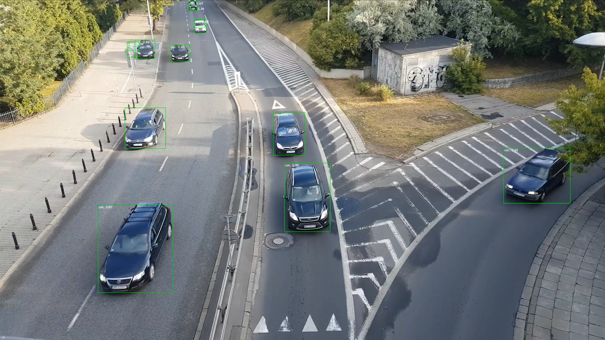
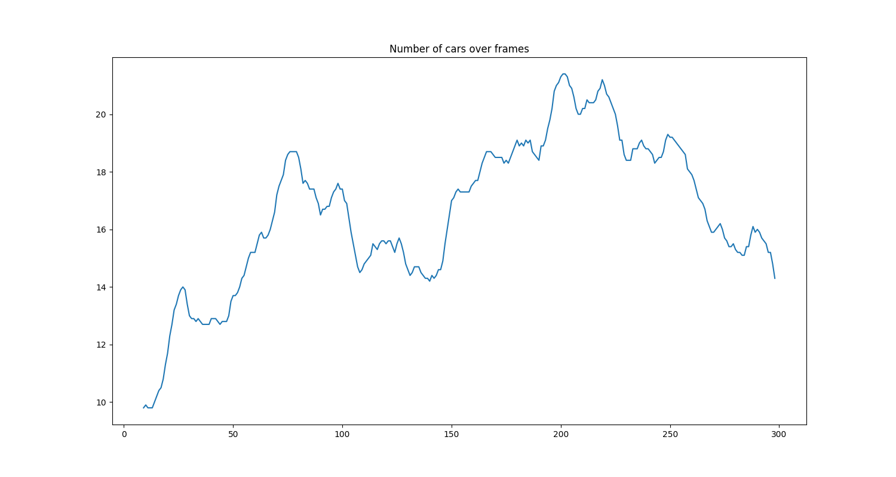

# ANNOVID v.0.3

The projects is set of tools prepared for pre- or postprocessing data in Computer Vision domain. Fow images aw well as videos. Main goal is to have codebase for repetetive tasks in many projects.  

**STATUS**: Things to be done marked in the code.  

# Demo 

For showcase/reference please go to **[DEMO](./demo.ipynb) notebook**.  
Check samples below for an idea:  

**Fast video annotation**:  

*Frame from video: https://www.youtube.com/watch?v=MNn9qKG2UFI which was used during tests in ths project.* 

**Object apperance heatmaps**:  

**Plot of object count**:  

**Ultra-quick baseline annotations**:  

# Features 
The code addresses taksks like:
- image **representations** (PIL/OpenCV/RGB vs BRG issues)
- image **cropping** & **scaling**
- **bbox** notation standarization
- video heatmaps  
- caching detections to pickle file

Visual helper methods include:
- bounding box drawing

# Dependencies
Code uses Python 3 syntax.   

**Core code uses:**  
- [OpenCV](https://pypi.org/project/opencv-python/)
- [numpy](https://pypi.org/project/numpy/) 
- [matplotlib](https://pypi.org/project/matplotlib/) 
- [Pillow](https://pypi.org/project/tqdm/)
- [tqdm](https://pypi.org/project/tqdm/)

**Sample are using additionally:**  
- PyTorch (torch, torchvision)

# License
This code is licensed with [Apache License Version 2.0](./LICENSE).  
Original author: Błażej Matuszewski, repository: [bwosh/annovid](https://github.com/bwosh/annovid).  
Used libraries are licensed separately. Please review them as well.