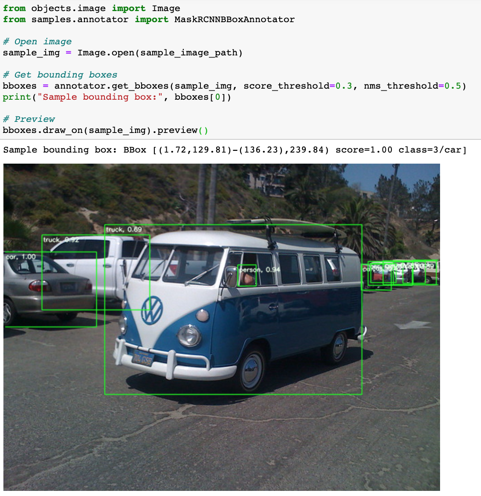

# ANNOVID v.0.1

The projects is set of tools prepared for pre- or postprocessing data in Computer Vision domain. Main goal is to have codebase for repetetive tasks in projects. There are methods for images & videos.

# Demo 

For showcase/reference please go to **[DEMO](./demo.ipynb) notebook**.  
Check samples below for an idea:  

**Ultra-quick baseline annotations**:  

# Status/Things to be done
- visualuzation: processing images/folders/videos
- visualuzation: creating images/frames preview maps 
- visualuzation:  video **heatmaps**
 - setup file for making library
 - (optionally) publishing to PyPI

 refer do "TODO"-s in code for more.

# Features 
The code addresses taksks like:
- image **representations** (PIL/OpenCV/RGB vs BRG issues)
- image **cropping** & **scaling**
- **bbox** notation standarization

Visual helper methods include:
- bounding box drawing

# Dependencies
Code uses Python 3 syntax.   

**Core code uses:**  
- [OpenCV](https://pypi.org/project/opencv-python/)
- [numpy](https://pypi.org/project/numpy/) 
- [Pillow](https://pypi.org/project/tqdm/)
- [tqdm](https://pypi.org/project/tqdm/)

**Sample are using additionally:**  
- PyTorch (torch, torchvision)

# License
This code is licensed with [Apache License Version 2.0](./LICENSE).  
Used libraries might by licensed other way. Please mind reviewing them before using.